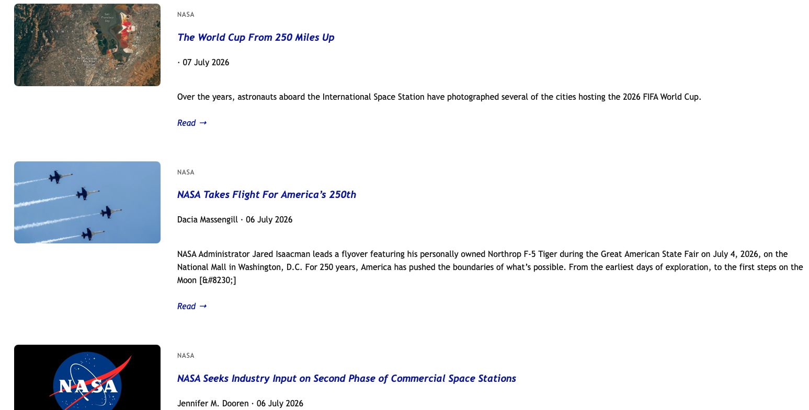

# RSS Feed Aggregator

A lightweight Python module for aggregating articles from multiple RSS feeds into a normalized, sortable collection.

Focuses on the aggregation pipeline—downloading RSS feeds, parsing XML content, normalizing article metadata, and combining results into a single list. It excludes any web interface or presentation layer.

This aggregation engine powers to some extent the Reading section of my website:

**Live Demo:** https://anthonyem.com/reading

---

## Features

* Aggregate articles from multiple RSS feeds
* Normalize articles into common data model
* Sort articles by publication date
* Extract article images when available
* Simple, modular architecture
* Easily extendable with additional RSS sources

---

## Project Structure

```text
rss_feed_aggregator/
├── aggregator.py
├── parser.py
├── feeds.py
└── models.py
```

---

## Architecture

The aggregation pipeline is intentionally small and modular.


1. RSS feeds are defined in `feeds.py`
2. `parser.py` downloads and parses each feed
3. Feed entries are normalized into `Article` objects
4. `aggregator.py` combines and sorts all articles

---

## Example

```python
from rss_feed_aggregator import load_articles

articles = load_articles()

for article in articles:
    print(article.title)
```

---

## Screenshots

Reading interface powered by this aggregation engine:



---

## Future Improvements

* Improve compatibility with RSS feeds that omit fields such as `summary`, `published_parsed`, or `content`
* Support multiple image extraction strategies for different feed formats
* Configurable article filtering
* Unit tests
* Cleaning corrupted feeds

---

## License

This project is licensed under the MIT License.
