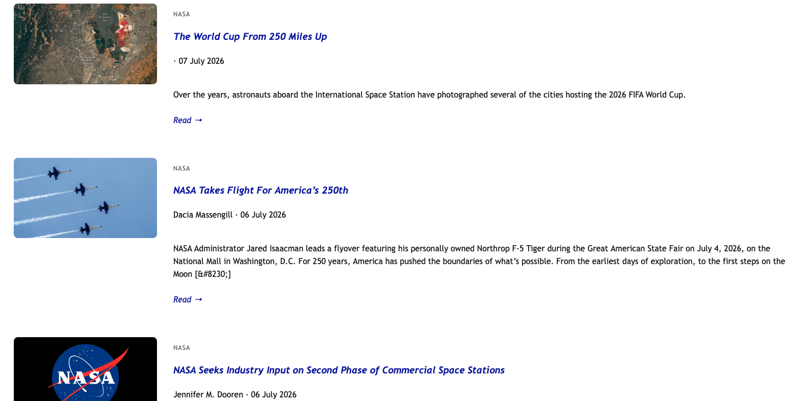

# RSS Feed Aggregator

A small, framework-independent Python engine for pulling articles from curated RSS/Atom feeds, normalizing inconsistent feed metadata into one common model, and returning a combined newest-first collection.

The project began as a standalone NASA feed experiment and later evolved inside the Reading section of `anthonyem.com`. This repository now contains the mature generic aggregation logic extracted back out of that portfolio integration, without any Flask, Jinja, Markdown, or presentation-layer code.

## Features

- Aggregate multiple RSS/Atom publications through one reusable pipeline
- Normalize feeds into a common `Article` dataclass
- Curated feed configuration with categories and fallback authors
- Publication-date parsing with updated-date fallback
- HTML cleanup and whitespace normalization for summaries
- Configurable summary truncation
- Multiple image extraction strategies:
  - Media RSS content
  - Media RSS thumbnails
  - embedded content images
  - summary images
  - image enclosures
- Configurable per-feed result limits
- Newest-first aggregation
- Custom `FeedSource` support
- Network-free unit tests for parsing and aggregation behavior
- No web-framework dependency

## Default sources

The included source set reflects the feeds used by the mature portfolio implementation:

| Category | Publication |
| --- | --- |
| Space | NASA |
| Technology | Ars Technica |
| Technology | MIT Technology Review |
| Science | Quanta Magazine |
| Science | Nautilus |
| Ideas | Aeon |
| Exploration | Atlas Obscura |
| Exploration / History | Smithsonian Magazine |

Feed availability and publisher RSS formats are external dependencies and can change independently of this project.

## Project structure

```text
rss_feed_aggregator/
├── __init__.py
├── aggregator.py
├── feeds.py
├── models.py
└── parser.py

examples/
└── basic_usage.py

tests/
├── test_aggregator.py
└── test_parser.py
```

## Installation

Create a virtual environment and install the two runtime dependencies:

```bash
python -m venv .venv
source .venv/bin/activate
pip install -r requirements.txt
```

## Basic usage

```python
from rss_feed_aggregator import load_articles

articles = load_articles(per_feed_limit=4)

for article in articles[:10]:
    print(article.source_label)
    print(article.title)
    print(article.published)
    print(article.link)
```

### Use your own feeds

```python
from rss_feed_aggregator import FeedSource, load_articles

feeds = [
    FeedSource(
        name="Example Publication",
        url="https://example.com/feed.xml",
        category="Research",
    )
]

articles = load_articles(feeds, per_feed_limit=10)
```

Use `per_feed_limit=None` to load every entry returned by each configured feed.

## Normalized article model

Each feed entry becomes an `Article` with:

```text
title
summary
author
published
link
image
source
category
```

`source_label` is also available as a convenience property, for example `Science • Quanta Magazine`.

## Testing

The test suite does not make network requests:

```bash
python -m unittest discover -s tests -v
```

Live feed behavior is intentionally separate from the unit suite because publishers can change availability and RSS markup without warning.

## Architecture

See [`docs/architecture.md`](docs/architecture.md) for the extraction and normalization pipeline.


## Historical integration

The aggregator was developed to power a Reading interface that mixed curated external publications with first-party writing. The web interface is not part of this repository; the screenshot below is retained as context for the project that consumed the engine.



## Maintenance notes

This extraction incorporates the mature portfolio parser rather than the original single-feed prototype. In particular, it adds the broader source set, robust date fallbacks, summary cleaning, and the image extraction strategies that accumulated during real use.

Application-specific behavior from the portfolio—internal articles, featured selection, Flask/Jinja rendering, and caching—has deliberately not been copied into this package.

## License

MIT. See [`LICENSE`](LICENSE).
